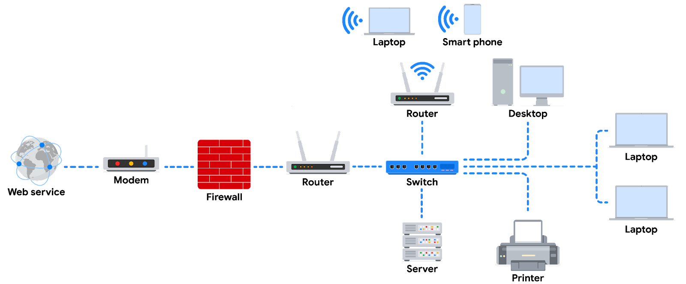

# Module 1: Network Architecture

## Overview

* **Structure of a network**
* **Standard networking tools**
* **Cloud networks**
* **TCP/IP model**

## Structure of a Network

A network is a group of connected devices. It is the overall infrastructure that allows devices to communicate with each other. Network devices are specialized vehicles like routers and switches that manage what is being sent and received over the network. Additionally, devices like computers and phones connect to the network via network devices.

## Network Tools

### Hubs and switches

Hubs and switches both direct traffic on a local network. A hub is a device that provides a common point of connection for all devices directly connected to it. Hubs additionally repeat all information out to all ports. From a security perspective, this makes hubs vulnerable to eavesdropping. For this reason, hubs are not used as often on modern networks; most organizations use switches instead. Hubs are more commonly used for a limited network setup like a home office.

Switches are the preferred choice for most networks. A switch forwards packets between devices directly connected to it. They analyze the destination address of each data packet and send it to the intended device. Switches maintain a MAC address table that matches MAC addresses of devices on the network to port numbers on the switch and forwards incoming data packets according to the destination MAC address. Switches are a part of the data link layer in the TCP/IP model. Overall, switches improve performance and security.

### Routers

Routers connect networks and direct traffic, based on the IP address of the destination network. Routers allow devices on different networks to communicate with each other. In the TCP/IP model, routers are a part of the network layer. The IP address of the destination network is contained in the IP header. The router reads the IP header information and forwards the packet to the next router on the path to the destination. This continues until the packet reaches the destination network. Routers can also include a firewall feature that allows or blocks incoming traffic based on information in the transmission. This stops malicious traffic from entering the private network and damaging the local area network.

### Modems

Modems usually connect your home or office with an internet service provider (ISP). ISPs provide internet connectivity via telephone lines, coaxial cables, or fiber optic cables. Modems receive transmissions or digital signals from the internet and convert them into a digital format compatible with the physical connection provided by your ISP. Usually, modems connect to a router that takes the decoded transmissions and sends them on to the local network.

### Wireless access points

A wireless access point sends and receives digital signals over radio waves creating a wireless network. Devices with wireless adapters connect to the access point using Wi-Fi. Wi-Fi refers to a set of standards that are used by network devices to communicate wirelessly. Wireless access points and the devices connected to them use Wi-Fi protocols to send data through radio waves where they are sent to routers and switches and directed along the path to their final destination.

## Cloud Network

Traditional networks are called on-premise networks, which means that all of the devices used for network operations are kept at a physical location owned by the company, like in an office building. A cloud network is a collection of servers or computers that stores resources and data in remote data centres that can be accessed via the internet instead of at a physical location.

Virtualization tools are pieces of software that perform network operations. Virtualization tools carry out operations that would normally be completed by a hub, switch, router, or modem, and they are offered by Cloud service providers.

A cloud service provider (CSP) is a company that offers cloud computing services. CSPs provide three main categories of services:

* **Software as a service (SaaS):** Software suites operated by the CSP that companies can use remotely without hosting the software.
* **Infrastructure as a service (IaaS):** Virtual containers and storage services can be used to operate existing applications and other technology workloads without significant modifications.
* **Platform as a service (PaaS):** Tools that application developers can use to design custom applications for their company.

Three of the main reasons that cloud computing is so attractive to businesses are **reliability**, **decreased cost**, and **increased scalability**.

## TCP/IP Model

The TCP/IP model is a framework used to visualize how data is organized and transmitted across a network. The TCP/IP model has four layers: the network access layer, internet layer, transport layer, and application layer. When troubleshooting issues on the network, security professionals can analyze which layers were impacted by an attack based on what processes were involved in an incident.

* **Network access layer:** Sometimes called the data link layer, deals with the creation of data packets and their transmission across a network. This layer corresponds to the physical hardware involved in network transmission. Hubs, modems, cables, and wiring are all considered part of this layer.
* **Internet layer:** Sometimes referred to as the network layer, is responsible for ensuring the delivery to the destination host, which potentially resides on a different network. It ensures IP addresses are attached to data packets to indicate the location of the sender and receiver. Some of the common protocols that operate at the internet layer:
  * **Internet Protocol (IP)**: Sends the data packets to the correct destination and relies on the Transmission Control Protocol/User Datagram Protocol (TCP/UDP) to deliver them.
  * **Internet Control Message Protocol (ICMP):** Shares error information and status updates of data packets. This is useful for detecting and troubleshooting network errors. The ICMP reports information about packets that were dropped or that disappeared in transit, issues with network connectivity, and packets redirected to other routers.
* **Transport layer:** Is responsible for delivering data between two systems or networks and includes protocols to control the flow of traffic across a network. TCP and UDP are the two transport protocols that occur at this layer.
  * **Transmission Control Protocol (TCP):** Allows two devices to form a connection and stream data. It ensures that data is reliably transmitted to the destination service.
  * **User Datagram Protocol (UDP):** Is a connectionless protocol that does not establish a connection between devices before transmissions and delivery is not guaranteed. It is used mostly for performance sensitive applications that operate in real time, such as video streaming.
* **Application layer:** Is responsible for making network requests or responding to requests. This layer defines which internet services and applications any user can access. Protocols in the application layer determine how the data packets will interact with receiving devices. Some common protocols used on this layer are:
  * Hypertext transfer protocol (HTTP)
  * Simple mail transfer protocol (SMTP)
  * Secure shell (SSH)
  * File transfer protocol (FTP)
  * Domain name system (DNS)

### TCP/IP model versus OSI model

The OSI visually organizes network protocols into different layers. Network professionals often use this model to communicate with each other about potential sources of problems or security threats when they occur.

The TCP/IP model combines multiple layers of the OSI model. There are many similarities between the two models. Both models define standards for networking and divide the network communication process into different layers. The TCP/IP model is a simplified version of the OSI model.

## Glossary: Network Architecture

**Bandwidth:** The maximum data transmission capacity over a network, measured by bits per second

**Cloud computing:** The practice of using remote servers, application, and network services that are hosted on the internet instead of on local physical devices

**Cloud network:** A collection of servers or computers that stores resources and data in remote data centers that can be accessed via the internet

**Data packet:** A basic unit of information that travels from one device to another within a network

**Hub:** A network device that broadcasts information to every device on the network

**Internet Protocol (IP):** A set of standards used for routing and addressing data packets as they travel between devices on a network

**Internet Protocol (IP) address:** A unique string of characters that identifies the location of a device on the internet

**Local Area Network (LAN):** A network that spans small areas like an office building, a school, or a home

**Media Access Control (MAC) address:** A unique alphanumeric identifier that is assigned to each physical device on a network

**Modem:** A device that connects your router to the internet and brings internet access to the LAN

**Network:** A group of connected devices

**Open systems interconnection (OSI) model:** A standardized concept that describes the seven layers computers use to communicate and send data over the network

**Packet sniffing:** The practice of capturing and inspecting data packets across a network

**Port:** A software-based location that organizes the sending and receiving of data between devices on a network

**Router:** A network device that connects multiple networks together

**Speed:** The rate at which a device sends and receives data, measured by bits per second

**Switch:** A device that makes connections between specific devices on a network by sending and receiving data between them

**TCP/IP model:** A framework used to visualize how data is organized and transmitted across a network

**Transmission Control Protocol (TCP):** An internet communication protocol that allows two devices to form a connection and stream data

**User Datagram Protocol (UDP):** A connectionless protocol that does not establish a connection between devices before transmissions

**Wide Area Network (WAN):** A network that spans a large geographic area like a city, state, or country